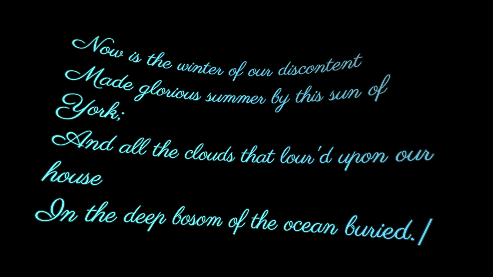

<h1 align="center"> Tuppu </h1>
<h2> A cuneiform tablet VR multi app </h2>
 

 
 
 

## Features

- Built with [troika-three-text](https://www.npmjs.com/package/troika-three-text) and [Croquet](https://croquet.io/)
- Built for the Pluto [Multi App Launcher](http://chimera.pluto.app/)

---

## Usage

## [TODO]

## Development & Building

- `npm start` will launch the dev server and open the scene.

- `npm run build` will process and build your project into a `dist` folder.

- `npm run build-xrpk` will `npm build`, then create an [XR Package](https://github.com/webaverse/xrpackage) in `dist`. (Note that this script runs an interactive CLI for details about the various aspects of your XR Package.)

- `npm run dev-xrpk` will do the same but output an _unminified, source-mapped_ XR Package to help you debug your XR Package in your runtime of choice (we recommend [Chimera](https://chimera.pluto-api.com/)). Please note the resulting .wbn file size will be very large - don't use this in production!

---
